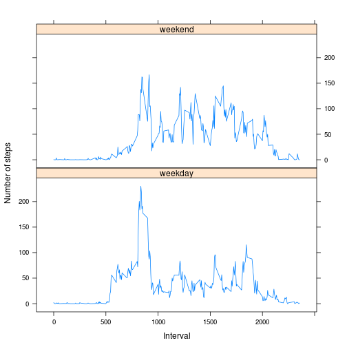

## Part 1
### Histogram

```r
# Assumes the file "activity.csv" is in the working directory.

df_activity <- read.csv(file = "activity.csv",
                        header = TRUE)
#Remove NAs:
df_activity_complete_cases <- df_activity[complete.cases(df_activity), ]

#Split on date and compute sum for each month,
#empty factor levels are dropped:
s <- split(df_activity_complete_cases, 
           df_activity_complete_cases$date, 
           drop = TRUE)

l1 <- sapply(s, function(x) sum(x[, c("steps")]))

#Plot the histogram:
plot(as.table(l1),
     type = "h",
     lwd = 6, 
     lend = 2, 
     main = "Total number of steps taken each day",
     xlab = "Date",
     ylab = "Total number of steps")
```

 

### Mean and median

```r
mean(l1)
```

```
## [1] 10766.19
```

```r
median(l1)
```

```
## [1] 10765
```

## Part 2

### Time series plot

```r
#Make interval a factor in order to split on it:
df_activity_complete_cases$interval <- as.factor(df_activity_complete_cases$interval)

s2 <- split(df_activity_complete_cases, 
            df_activity_complete_cases$interval, 
            drop = TRUE)

#Compute the average number of steps for each interval
#(step count is in column 1 of each s2-entry):
l2 <- sapply(s2, function(x) mean(x[[1]]))

#Make a new data frame to use for the time series plot:
df_avg_steps <- data.frame(interval = as.numeric(names(l2)),
                           avgSteps = as.numeric(l2))

plot(df_avg_steps$"interval",
     df_avg_steps$"avgSteps",
     type = "l",
     xlab = "5-minute interval",
     ylab = "Average number of steps",
     main = "Average number of steps averaged across all days")
```

 

### Interval containing the maximum number of steps

```r
#The column "avgSteps" is rounded to 4 decimals because the
#max function only uses 4 decimals:
n2 <- round(as.numeric(df_avg_steps$"avgSteps"), digits = 4)

i <- which(n2 == max(n2))  #The index (only one) for the maximum
                           #number of steps.

#The interval containing the maximum number of steps:
maxInterval <- df_avg_steps[i, ]$"interval"
```

The 5-minute interval containing the maximum number of steps is 835.

## Part 3
### Total number of missing values

```r
#Total number of rows with NAs:
naVec <- 
  is.na(df_activity$steps) | is.na(df_activity$date) | is.na(df_activity$interval)

numberRowsNA <- sum(naVec)
```
The total number of missing values in the dataset is 2304.

### Strategy for filling in all of the missing values in the dataset
There are only missing values for the number of steps taken.
The chosen strategy for filling in all of the missing values in the dataset is the simple one of using the mean for the number of steps taken at each 5-minute interval where the number of steps are missing. The mean is taken across all the days where data is available.


### New dataset equal to the original dataset but with missing data filled in

```r
#Dataset where each row has missing data:
df_activity_NA <- df_activity[naVec, ]
#The column "interval" is cast to the same type as that of "df_avg_steps"
#in order to merge them:
df_activity_NA$interval <- as.numeric(df_activity_NA$interval)

#Merge "df_activity_NA" and "df_avg_steps" on "interval".
df_activity_NA_merge <- merge(x = df_activity_NA,
                              y = df_avg_steps,
                              by.x = "interval",
                              by.y = "interval")

#The numbers in the column "steps" are rounded to zero decimals
#because the resulting dataset should only count steps in whole numbers:
df_activity_NA_merge$steps <- round(df_activity_NA_merge$avgSteps)

#The dataset containing only imputed rows is created:
df_activity_complete_cases_imputed <-
  df_activity_NA_merge[, c("steps", "date", "interval")]

#The resulting dataset with both imputed rows and original complete rows
#is created:
df_activity_complete_cases_all <- rbind(df_activity_complete_cases_imputed,
                                        df_activity_complete_cases)

#The resulting dataset is ordered by date (column 2):
df_activity_complete_cases_all <- 
  df_activity_complete_cases_all[order(df_activity_complete_cases_all[, 2]), ]
```

### Histogram

```r
s3 <- split(df_activity_complete_cases_all, 
            df_activity_complete_cases_all$date, 
            drop = TRUE)

l3 <- sapply(s3, function(x) sum(x[, c("steps")]))

plot(as.table(l3),
     type = "h",
     lwd = 6, 
     lend = 2, 
     main = "Total number of steps taken each day",
     xlab = "Date",
     ylab = "Total number of steps")
```

 

### Mean and median

```r
mean(l3)
```

```
## [1] 10765.64
```

```r
median(l3)
```

```
## [1] 10762
```

The original mean was 10766.19 and the new mean is  10765.64. The mean has decreased, so the values differ.

The original median was 10765 and the new median is 10762. The median has decreased, so the values differ.

The two histograms show similar distribution patterns, but the latter histogram (which includes imputed values) show extra dates such as "2012-10-01". The extra dates are expected since the original dates had NA in the number of steps and the new ones have been updated with imputed values.

## Part 4
### New factor variable

```r
#Get the weekday names for each of the dates:
weekdaysVec <- 
  weekdays(as.Date(as.character(df_activity_complete_cases_all$"date")))

#Create a factor dividing the weekdays into levels "weekday" and "weekend":
weekdaysDividedVec <- 
  as.factor(
    as.character(
      lapply(X = weekdaysVec,
             FUN = function(x) if (x %in% c("Monday", "Tuesday","Wednesday","Thursday","Friday"))
               "weekday"
             else
               "weekend")
      )
    )

#Add the new factor as a column:
df_activity_complete_cases_all$weekdaysDivided <- weekdaysDividedVec
```

### Panel plot

```r
library(lattice)
#Make column "interval" a factor in order to split on it later:
df_activity_complete_cases_all$interval <-
  as.factor(as.numeric(df_activity_complete_cases_all$interval))

#Make two dataframes, one for "weekday" and one for "weekend":
df_activity_complete_cases_all_weekday <-
  df_activity_complete_cases_all[as.character(df_activity_complete_cases_all$"weekdaysDivided") == "weekday", ]

df_activity_complete_cases_all_weekend <-
  df_activity_complete_cases_all[as.character(df_activity_complete_cases_all$"weekdaysDivided") == "weekend", ]

#Make dataframe for average steps on weekdays using split and sapply:
s_weekday <- split(df_activity_complete_cases_all_weekday,
                   df_activity_complete_cases_all_weekday$interval,
                   drop = TRUE)

l_weekday <- sapply(s_weekday, function(x) mean(x[[1]]))

df_avg_steps_weekday <- data.frame(interval = as.numeric(names(l_weekday)),
                                   avgSteps = as.numeric(l_weekday))

#Make dataframe for average steps on weekends using split and sapply:
s_weekend <- split(df_activity_complete_cases_all_weekend,
                   df_activity_complete_cases_all_weekend$interval,
                   drop = TRUE)

l_weekend <- sapply(s_weekend, function(x) mean(x[[1]]))

df_avg_steps_weekend <- data.frame(interval = as.numeric(names(l_weekend)),
                                   avgSteps = as.numeric(l_weekend))

#Combine the two dataframes using rbind after first extending
#each of them with a column for weekdays:
df_avg_steps_weekday$weekdaysDivided = "weekday"
df_avg_steps_weekend$weekdaysDivided = "weekend"

df_avg_steps_all <- rbind(df_avg_steps_weekday,
                          df_avg_steps_weekend)

#Make the column "weekdaysDivided" a factor (to be used by the plot
#function):
df_avg_steps_all$weekdaysDivided <-
  as.factor(df_avg_steps_all$weekdaysDivided)

#Plot:
p <- xyplot(avgSteps ~ interval | weekdaysDivided, data = df_avg_steps_all,
            layout = c(1, 2),
            type = "l",
            xlab = "Interval",
            ylab = "Number of steps")

print(p)
```

 
